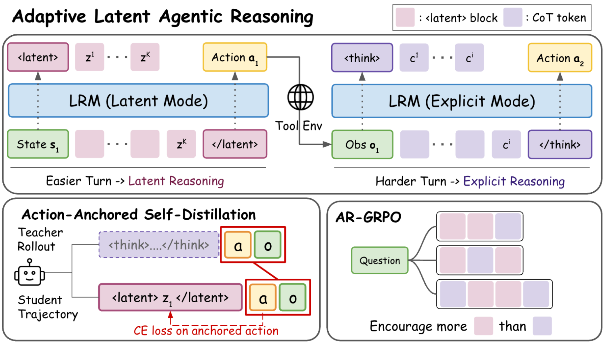
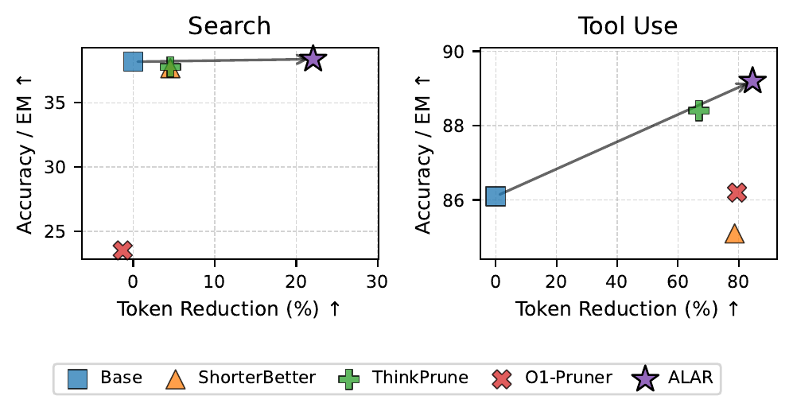

# Adaptive Latent Agentic Reasoning (ALAR)

Official implementation of **[Adaptive Latent Agentic Reasoning](https://arxiv.org/abs/2606.02871)**.

ALAR is a dual-mode reasoning framework for LLM agents. At each turn the agent chooses between two interchangeable reasoning surface forms:

- `<latent>••••</latent>` — **latent reasoning**: K=4 continuous thoughts produced by a projector in hidden-state space (no textual chain-of-thought is decoded)
- `<think>...</think>` — **explicit reasoning**: standard textual chain-of-thought, reserved for turns that need deeper deliberation

<p align="center">
  
</p>


## Training

Training has two stages:

1. **Stage 1 — Action-Anchored Self-Distillation (AASD).** The base model acts as a teacher in explicit mode; its successful trajectories are converted into student trajectories where each explicit CoT span is replaced by a latent block. The student (LoRA + projector) is trained to reproduce the teacher's *actions* (search queries / tool calls / answers) conditioned on the latent block — actions, not CoT tokens, are the supervision anchors.
2. **Stage 2 — Adaptive mode selection.** A brief **mode-warmup** SFT (per-turn coin flip between latent and explicit blocks) exposes both modes, then **AR-GRPO** optimizes per-turn mode selection: latent reasoning is rewarded when task success is preserved, with a decayed diversity bonus and a length-scaling factor on overlong explicit reasoning.

At inference, a vLLM plugin drives the latent block autonomously: when the model emits `<latent>`, the plugin splices K projector outputs into the next K positions and force-emits `</latent>`.

## Performance

Across agentic search and tool-use benchmarks, ALAR matches or improves base-model accuracy while reducing generated tokens by up to 43.6% (search) and 84.6% (tool use), giving a better accuracy–efficiency trade-off than reasoning-token compression baselines:

<p align="center">
  
</p>

## Repository layout

```
scripts/                      Pipeline entry points
  train_stage1.sh             Stage 1 — AASD SFT
  train_stage2.sh             Stage 2 — mode warmup + AR-GRPO (incl. adapter merges)
  eval.sh                     Sequential benchmark evaluation (both domains)
alar/                         Core library
  modeling.py                 LatentQwen2/Qwen3 + K-iteration projector
  vllm_plugin.py              vLLM plugin: K-sentinel state machine + force-emit </latent>
  sft/aasd.py                 AASD trainer (Stage 1 and mode warmup; LoRA + projector)
  sft_data/base.py            Latent-block dataset base (shared by both domains)
  rl/ar_grpo.py               AR-GRPO reward shaping (verl extract_reward patch)
  rl/install_patches.py       verl integration patches (projector sync, ckpt save, cached-z)
  rl/runner.py                Domain-agnostic verl TaskRunner
  scripts/merge_*.py          Adapter / FSDP-shard merging into vLLM-loadable checkpoints
search/                       Search domain (Search-R1 base, Qwen2.5-3B/7B)
  config.py                   System prompt + protocol tags
  dataset.py                  AASD dataset over teacher traces
  evaluate_vllm.py            Multi-turn agentic QA eval
  rl/                         Agent loop, reward, AR-GRPO entry point + configs
  scripts/generate_traces.py  Teacher-trace collection
  scripts/prepare_rl_data.py  RL prompt parquet
  scripts/retrieval/          E5 + FAISS retrieval server (wiki-18)
tool/                         Tool-use domain (Qwen3-4B-Thinking, BFCL)
  config.py                   System prompt + protocol tags
  dataset.py                  AASD dataset over ToolMind rollouts
  evaluate_vllm.py            BFCL AST-checked eval
  rl/                         Single-shot agent loop, AST-match reward, AR-GRPO entry point + configs
  rollout/                    ToolMind teacher rollout runner + scoring
  scripts/                    Rollout launcher + SFT/RL data prep
verl/                         Vendored verl (0.8.0.dev) with ALAR integration patches
assets/                       Paper figures used in this README
```

The vendored `verl/` carries small patches for the ALAR stack (LoRA `modules_to_save` shim for the projector, custom model-type registration, worker install hooks). `alar/rl/install_patches.py` targets this exact tree — use it rather than upstream verl.

## Installation

Requires Python 3.10–3.12, CUDA 12.8 drivers, and [uv](https://docs.astral.sh/uv/):

```bash
uv sync                                   # creates .venv with torch 2.10 + vLLM 0.19
source .venv/bin/activate
uv pip install -e verl/ --no-deps         # vendored verl on top
uv pip install "ray[default]" codetiming hydra-core \
    "tensordict>=0.8,<=0.10,!=0.9" torchdata dill pylatexenc pandas wandb tensorboard
```

The retrieval server additionally needs `faiss-gpu` (or `faiss-cpu` for CPU mode) and `uvicorn`; the E5 encoder is covered by `transformers`.

## Training and evaluation

Each pipeline step is one script. All hyperparameters default to the paper settings; run any script with `--help` for the full option/env-var list.

### Search domain

Base models: [`PeterJinGo/SearchR1-nq_hotpotqa_train-qwen2.5-7b-em-ppo-v0.3`](https://huggingface.co/PeterJinGo/SearchR1-nq_hotpotqa_train-qwen2.5-7b-em-ppo-v0.3) (default) and the 3B variant. Retrieval uses the wiki-18 corpus + E5 Flat index released by [Search-R1](https://github.com/PeterGriffinJin/Search-R1).

```bash
# 0. Retrieval server (keep running; wait for /health)
CORPUS_PATH=data/wiki-18/wiki-18.jsonl INDEX_PATH=data/wiki-18/e5_Flat.index \
    bash search/scripts/retrieval/start.sh

# 1. Teacher traces: roll out the base model in explicit mode on its training pool
python search/scripts/generate_traces.py \
    --model_id PeterJinGo/SearchR1-nq_hotpotqa_train-qwen2.5-7b-em-ppo-v0.3 \
    --input_hf PeterJinGo/nq_hotpotqa_train \
    --output_path data/search/teacher_traces.jsonl --tensor_parallel_size 4

# 2. Stage 1 — AASD
bash scripts/train_stage1.sh --domain search

# 3. Stage 2 — mode warmup + AR-GRPO (auto-prepares RL data and merges adapters)
bash scripts/train_stage2.sh --domain search

# 4. Evaluate (NQ, TriviaQA, HotpotQA, 2Wiki, MuSiQue, Bamboogle — sequential)
bash scripts/eval.sh --domain search --ckpt checkpoints/rl_merged/alar_search
```

For the 3B model, pass `--model PeterJinGo/SearchR1-nq_hotpotqa_train-qwen2.5-3b-em-ppo-v0.3` to both training scripts (batch/offload presets adjust automatically).

### Tool-use domain

Base model: [`Qwen/Qwen3-4B-Thinking-2507`](https://huggingface.co/Qwen/Qwen3-4B-Thinking-2507). Teacher data comes from the `graph_syn` subset of [ToolMind](https://huggingface.co/datasets/Nanbeige/ToolMind); evaluation is AST-level matching on [BFCL](https://huggingface.co/datasets/gorilla-llm/Berkeley-Function-Calling-Leaderboard).

```bash
# 1. Teacher rollouts (serve the model with vLLM, roll out per shard, filter)
vllm serve Qwen/Qwen3-4B --port 9004 &
SHARD_IDX=0 NUM_SHARDS=4 PORT=9004 bash tool/scripts/run_turn_sync_toolmind.sh
python -m tool.scripts.prepare_sft_data \
    --src data/tool/toolmind_rollouts --out data/tool/sft_traces.jsonl

# 2-4. Train + evaluate
bash scripts/train_stage1.sh --domain tool
bash scripts/train_stage2.sh --domain tool
bash scripts/eval.sh --domain tool --ckpt checkpoints/rl_merged/alar_tool
```

### Script parameters

| Flag | `train_stage1.sh` | `train_stage2.sh` | `eval.sh` |
|---|---|---|---|
| `--domain` | `search` \| `tool` (required) | same | same |
| `--model` | base model (default: paper model) | same | — |
| `--data` | teacher-trace JSONL | same | — |
| `--run-name` | checkpoint prefix (default `alar_<domain>`) | same (must match Stage 1) | — |
| `--rl-steps` | — | AR-GRPO steps (default 100) | — |
| `--rl-only` / `--ckpt` | — | skip warmup / custom RL init | `--ckpt` = merged ckpt to eval (required) |
| `--datasets`, `--max-examples`, `--out` | — | — | eval scope / output dir |

Checkpoints land under `checkpoints/` (`sft/` adapters → `sft_merged/` warmup → `rl/` raw → `rl_merged/` final eval model); results under `results/<ckpt name>/`.

## How the latent block works

- `<latent>` / `</latent>` are ordinary multi-piece BPE literals — no new tokens are added to the vocabulary. The K inner positions hold the bullet sentinel `•` (a single-piece, non-merging token).
- **Training** (`alar/modeling.py`): for each latent block, the text prefix is forwarded with KV cache, then the projector f_φ iterates K times in hidden-state space (`z_k = f_φ(h_{k-1})`, each `z_k` fed back as the next input embedding). A final batched forward over the assembled embeddings yields the logits; cross-entropy is applied only on mode tokens and anchor actions, never on the K latent positions or environment observations.
- **Inference** (`alar/vllm_plugin.py`): a per-request state machine detects the `<latent>` literal during decoding, overrides the next K input embeddings with projector outputs, then force-emits the `</latent>` pieces. Prefix caching keeps the latent KV intact across agent turns.
- **RL**: verl's hybrid engine syncs LoRA deltas natively; the projector is synced actor→vLLM via a small file-IPC sidecar (`LATENT_SYNC_PATH`). The z values computed during rollout are optionally cached (`LATENT_CACHED_Z=1`) and reused by the actor's log-prob computation to skip the K-iteration recompute.

## Acknowledgements

This codebase builds on several open-source projects:

- [verl](https://github.com/volcengine/verl) — the RL training framework; a patched copy is vendored under `verl/` (retaining its Apache-2.0 license).
- [Search-R1](https://github.com/PeterGriffinJin/Search-R1) — the search-domain base models, training pool, and the wiki-18 retrieval corpus + index.
- [Atropos](https://github.com/NousResearch/atropos) — the tool-call validation and scoring helpers in `tool/rollout/scoring.py` are adapted from its tool-use environment.

## Citation

```bibtex
@article{jung2026adaptive,
  title={Adaptive Latent Agentic Reasoning},
  author={Jung, Dongwon and Shi, Peng and Zhang, Yi and Zhang, Junshan and Chen, Muhao},
  journal={arXiv preprint arXiv:2606.02871},
  year={2026}
}
```